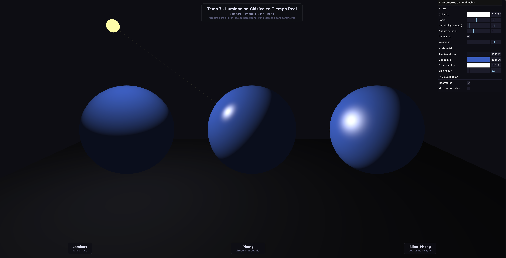

# Tema 7 – Iluminación Clásica en Tiempo Real

## Actividad S2_1 · Descomponiendo el Pipeline Gráfico

---

## Información

| Campo              | Detalle                                                   |
|--------------------|-----------------------------------------------------------|
| **Tema**           | 7 – Iluminación Clásica en Tiempo Real                    |
| **Estudiante(s)**  | Angel Santiago Avendaño Cañon ,John Alejandro Pastor Sandoval, Nelson Ivan Castellanos Betancourt, Samuel Josué Vargas Castro |
| **Fecha de entrega** | Febrero 2026                                            |
| **Implementación** | Three.js + Vite · Shaders GLSL personalizados             |

---

## Descripción del tema

La iluminación clásica en tiempo real modela cómo la luz interactúa con las superficies mediante aproximaciones matemáticas simples pero perceptualmente convincentes. El pipeline de iluminación local considera tres componentes:

- **Ambiental** – luz de fondo constante, independiente de la geometría.
- **Difusa (Lambert)** – reflexión en todas las direcciones; depende del ángulo de incidencia.
- **Especular** – reflexión de brillo; concentrada en una dirección.

Los tres modelos implementados varían en cómo calculan el término especular.

---

## Explicación matemática

### Coordenadas necesarias

Todos los cálculos se hacen en **espacio de vista** (view space), donde la cámara está en el origen.

```
N  = normalize(normalMatrix × normal)   // normal en view space
L  = normalize(lightPos - fragPos)      // dirección hacia la luz
V  = normalize(-fragPos)                // dirección hacia la cámara
```

### Modelo de Lambert (solo difuso)

```
L_difuso = k_d · I · max(dot(N, L), 0)
```

La superficie absorbe y reemite luz de forma isotrópica. No hay brillo especular.
La ley del coseno de Lambert explica por qué una superficie inclinada recibe menos energía.

### Modelo de Phong (1975)

```
R        = reflect(-L, N)             // vector de reflexión
L_espec  = k_s · I · max(dot(R, V), 0)^n
```

El vector **R** es la dirección de reflexión perfecta sobre la normal. El brillo decae
como $\cos^n(\alpha)$ donde $\alpha$ es el ángulo entre **R** y **V**.

**Problema:** cuando V y R forman un ángulo > 90° (geometría rasante), `dot(R,V)` puede
volverse negativo y clampear abruptamente, generando artefactos.

### Modelo de Blinn-Phong (1977)

```
H        = normalize(L + V)           // vector halfway (bisectriz)
L_espec  = k_s · I · max(dot(N, H), 0)^n
```

Jim Blinn reemplazó **R** por el vector **H** (bisectriz entre L y V). Esto:

1. Nunca genera valores negativos en geometría rasante.
2. Coincide mejor con superficies microscópicas reales.
3. Es más eficiente (sin `reflect()`).
4. Fue el modelo del pipeline fijo de OpenGL/DirectX.

**Equivalencia aproximada:** `n_blinn ≈ 4 × n_phong` para lóbulos de ancho similar.

### Ecuación completa

$$
L = \underbrace{k_a \cdot I_a}_{\text{ambiental}} + \underbrace{k_d \cdot I \cdot \max(\mathbf{N} \cdot \mathbf{L},\ 0)}_{\text{difuso}} + \underbrace{k_s \cdot I \cdot \max(\mathbf{N} \cdot \mathbf{H},\ 0)^n}_{\text{especular (Blinn-Phong)}}
$$

### Transformación de normales

Las normales **no** se transforman con la `modelViewMatrix` directamente. Si hay escalado
no uniforme, la normal quedaría torcida. La transformación correcta es:

$$
\mathbf{N}_{view} = \text{normalize}\left((\mathbf{M}^{-1})^T \cdot \mathbf{N}_{local}\right)
$$

En GLSL esto es el `normalMatrix` que Three.js calcula automáticamente.

---

## Descripción de la implementación

### Estructura

```
threejs/
├── index.html
├── package.json
└── src/
    ├── main.js            ← escena Three.js + GUI + loop de animación
    ├── style.css          ← estilos de la UI superpuesta
    └── shaders/
        ├── lambert.vert   ← vértice: transforma normal y posición
        ├── lambert.frag   ← fragmento: solo difuso
        ├── phong.vert
        ├── phong.frag     ← fragmento: difuso + especular Phong (vector R)
        ├── blinnphong.vert
        └── blinnphong.frag ← fragmento: difuso + especular Blinn (vector H)
```

### Puntos técnicos clave

- **Shaders personalizados GLSL** (`ShaderMaterial`) en lugar de `MeshPhongMaterial`.
  Esto permite ver exactamente qué matemáticas ocurren, no una caja negra.
- **Cálculos en view space**: la cámara siempre está en el origen → `V = normalize(-fragPos)`.
- **Posición de la luz en view space**: se transforma con `camera.matrixWorldInverse`
  antes de enviarse como uniform al shader.
- **Corrección gamma** (`pow(color, 1/2.2)`) para que los colores se vean correctamente
  en pantallas sRGB.
- **Panel GUI** (lil-gui) para modificar en tiempo real: colores, shininess, posición de luz,
  velocidad de animación, y toggle de visualización de normales.

---

## Resultados visuales

> Capturas en `media/`. A continuación se describe lo que debería observarse:


### Capturas de resultados



*Figura: De izquierda a derecha – Lambert (solo difuso), Phong (especular con brillo concentrado) y Blinn-Phong (especular más suave).*


---

## Código relevante

### Cálculo especular – Phong vs Blinn-Phong

```glsl
// ── Phong ───────────────────────────────────────────────────
vec3 R = reflect(-L, N);               // reflexión perfecta
float spec = pow(max(dot(R, V), 0.0), uShininess);

// ── Blinn-Phong ─────────────────────────────────────────────
vec3 H = normalize(L + V);             // vector halfway
float spec = pow(max(dot(N, H), 0.0), uShininess);
```

### Sincronización de uniforms en view space

```js
// main.js – cada frame, antes de renderizar
lightViewPos.copy(lightWorldPos).applyMatrix4(camera.matrixWorldInverse);
mat.uniforms.uLightPos.value.copy(lightViewPos);
```

---

## Prompts utilizados (IA)

> _(completar con los prompts usados si se utilizó IA generativa)_

Prompts para generación de código:
- Se incluyo el markdown de la actividad
- "Crea un ejemplo ilustrativo de shading para el tema 7 con Three.js y Vite"

---

## Aprendizajes y dificultades

### Aprendizajes
- La diferencia entre Phong y Blinn-Phong es sutil visualmente pero importante matemáticamente:
  el vector **H** es más estable que **R** en ángulos rasantes.
- La `normalMatrix` es crucial; ignorarla produce normales incorrectas al escalar objetos.
- Los cálculos en view space simplifican la dirección de vista a `V = -fragPos`.

### Dificultades
- Transformar correctamente la posición de la luz a view space cada frame (olvidarlo causa
  que la luz "siga" a la cámara en lugar de estar fija en el mundo).
- Entender por qué `shininess` debe ser ≈4× mayor en Blinn-Phong para igualar el lóbulo
  de Phong (diferencia en el ángulo medido: α vs α/2).
