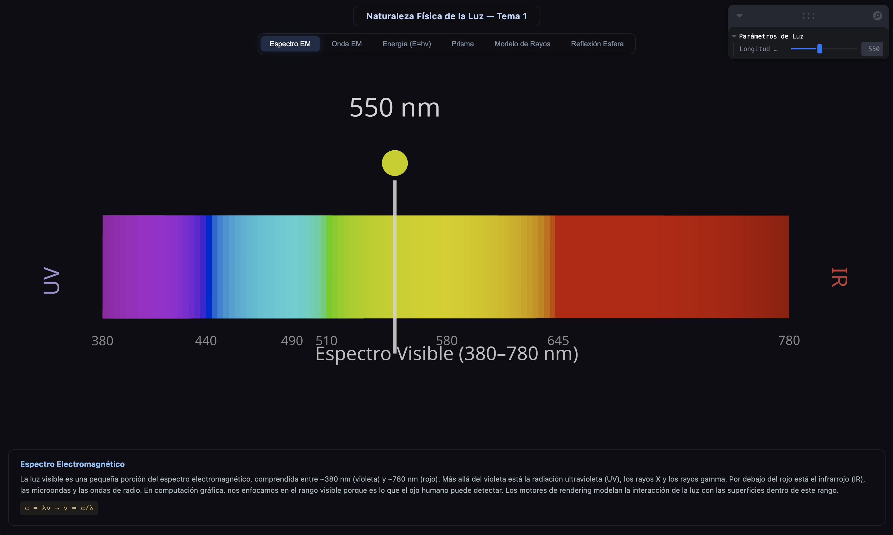
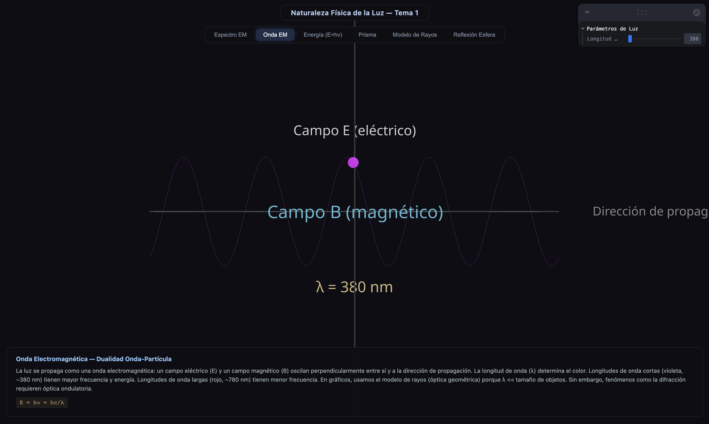
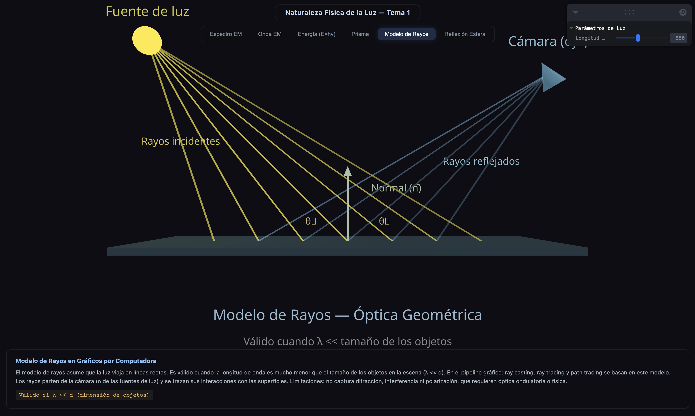

# Semana 4.1 — Fundamentos Físicos del Rendering

## Tema 1: Naturaleza Física de la Luz

### Estudiante(s)

- *Nelson Ivan Castellanos Bentacourt*
- *Angel Santiago Avendaño Cañon*
- *John Alejandro Pastor Sandoval*
- *Samuel Josue Vargas Castro*

### Fecha de entrega

- Lunes 2 de marzo de 2026

---

## Descripción del tema

La luz es una onda electromagnética que transporta energía a través del espacio. Para comprender cómo los motores gráficos simulan iluminación, es necesario entender las propiedades físicas fundamentales de la luz:

- **Espectro electromagnético**: La luz visible (380–780 nm) es una fracción del espectro electromagnético, que incluye rayos gamma, rayos X, ultravioleta, infrarrojo, microondas y ondas de radio.
- **Relación longitud de onda–color**: Cada longitud de onda dentro del rango visible corresponde a un color percibido, desde violeta (~380 nm) hasta rojo (~780 nm).
- **Dualidad onda-partícula**: La luz se comporta como onda (campos E y B perpendiculares) y como partícula (fotones con energía cuantizada).
- **Modelo de rayos**: En gráficos por computadora, simplificamos la luz como rayos rectilíneos (óptica geométrica), válido cuando λ << tamaño de los objetos.

---

## Explicación matemática resumida

### Relación velocidad–longitud de onda–frecuencia

$$c = \lambda \nu$$

Donde:
- $c = 2.998 \times 10^8 \, \text{m/s}$ (velocidad de la luz)
- $\lambda$ = longitud de onda (m)
- $\nu$ = frecuencia (Hz)

### Energía del fotón

$$E = h\nu = \frac{hc}{\lambda}$$

Donde:
- $h = 6.626 \times 10^{-34} \, \text{J}\cdot\text{s}$ (constante de Planck)
- Fotones violeta (~380 nm): $E \approx 3.26 \, \text{eV}$
- Fotones rojos (~780 nm): $E \approx 1.59 \, \text{eV}$

### Ley de Snell (dispersión)

$$n_1 \sin(\theta_1) = n_2 \sin(\theta_2)$$

El índice de refracción $n(\lambda)$ depende de la longitud de onda, causando dispersión cromática.

### Validez del modelo de rayos

El modelo de rayos (óptica geométrica) es válido cuando:

$$\lambda \ll d$$

donde $d$ es la dimensión característica de los objetos en la escena. Como $\lambda_{\text{visible}} \approx 400\text{–}700 \, \text{nm}$ y los objetos típicos son del orden de centímetros o metros, esta condición se cumple ampliamente.

---

## Descripción de la implementación

### Tecnología

**Three.js con React Three Fiber** (Vite + React)

### Escenas interactivas

La implementación consiste en **5 visualizaciones interactivas** organizadas en pestañas:

| Pestaña | Descripción |
|---------|-------------|
| **Espectro EM** | Barra espectral coloreada (380–780 nm) con indicador deslizable que muestra el color correspondiente a cada longitud de onda |
| **Onda EM** | Animación 3D de una onda electromagnética con campos E (eléctrico) y B (magnético) perpendiculares, más un fotón viajero |
| **Energía (E=hν)** | Diagrama de barras mostrando la energía del fotón para distintas longitudes de onda, demostrando la relación inversa E ∝ 1/λ |
| **Prisma** | Simulación de dispersión de luz blanca a través de un prisma, mostrando la separación espectral por refracción |
| **Modelo de Rayos** | Escena de óptica geométrica con fuente de luz, superficie, normales y rayos reflejados hacia una cámara |

### Controles interactivos

- **Leva GUI**: Slider de longitud de onda (380–780 nm) que afecta en tiempo real el espectro, la onda y el diagrama de energía
- **OrbitControls**: Rotación y zoom libre de las escenas 3D
- **Pestañas**: Navegación entre las cinco visualizaciones
- **Panel informativo**: Explicación física y ecuaciones relevantes para cada pestaña

### Archivos principales

```
threejs/src/
├── App.jsx                              # App principal con tabs y panel info
├── main.jsx                             # Entry point
├── index.css                            # Estilos
├── utils/
│   └── wavelengthToColor.js             # Conversión λ→RGB, cálculos físicos
└── components/
    ├── ElectromagneticSpectrum.jsx       # Barra espectral interactiva
    ├── WaveSimulation.jsx               # Onda EM animada (campos E y B)
    ├── EnergyDiagram.jsx                # Diagrama E = hν
    ├── PrismDispersion.jsx              # Dispersión por prisma
    └── RayModelScene.jsx                # Modelo de rayos / óptica geométrica
```

---

## Resultados visuales

### Evidencia 1 — Espectro Electromagnético interactivo

> *Captura de la barra espectral con el indicador posicionado en una longitud de onda específica, mostrando el color correspondiente.*



### Evidencia 2 — Simulación de Onda Electromagnética

> *Animación de la onda EM mostrando campos E y B perpendiculares, con el fotón viajando a lo largo de la dirección de propagación.*



### Evidencia 3 — Modelo de rayos / Óptica geométrica

> *Simulación de rayos de luz reflejados en una superficie, mostrando la geometría de reflexión.*



---

## Código relevante

### Conversión de longitud de onda a color RGB (algoritmo de Dan Bruton)

```javascript
export function wavelengthToRGB(wavelength) {
  let r = 0, g = 0, b = 0;

  if (wavelength >= 380 && wavelength < 440) {
    r = -(wavelength - 440) / (440 - 380);
    b = 1;
  } else if (wavelength >= 440 && wavelength < 490) {
    g = (wavelength - 440) / (490 - 440);
    b = 1;
  } else if (wavelength >= 490 && wavelength < 510) {
    g = 1;
    b = -(wavelength - 510) / (510 - 490);
  } else if (wavelength >= 510 && wavelength < 580) {
    r = (wavelength - 510) / (580 - 510);
    g = 1;
  } else if (wavelength >= 580 && wavelength < 645) {
    r = 1;
    g = -(wavelength - 645) / (645 - 580);
  } else if (wavelength >= 645 && wavelength <= 780) {
    r = 1;
  }
  // ... atenuación en extremos y corrección gamma
}
```

### Cálculo de energía del fotón

```javascript
export function photonEnergy(wavelengthNm) {
  const lambdaM = wavelengthNm * 1e-9;
  const E_joules = (PLANCK_CONSTANT * SPEED_OF_LIGHT) / lambdaM;
  return E_joules / 1.602e-19; // eV
}
```

---

## Prompts utilizados (asistencia con IA)

1. Se utilizó GitHub Copilot para generar la estructura base del proyecto y los componentes de React Three Fiber.
2. Se pidió ayuda para implementar el algoritmo de conversión de longitud de onda a RGB.
3. Se solicitó la creación de las 5 escenas interactivas cubriendo los conceptos del tema.

---

## Aprendizajes y dificultades

### Aprendizajes

- La luz visible es solo una fracción minúscula del espectro electromagnético, pero es la base de todo el rendering.
- La relación inversa entre longitud de onda y energía ($E = hc/\lambda$) explica por qué los fotones UV tienen más energía que los de luz roja.
- El modelo de rayos (óptica geométrica) funciona excepcionalmente bien en gráficos porque las longitudes de onda visibles (~400–700 nm) son órdenes de magnitud menores que los objetos típicos en una escena.
- La dispersión cromática (dependencia de $n$ con $\lambda$) es un fenómeno real que los motores gráficos simulan para efectos como aberración cromática de lentes.

### Dificultades

- Representar visualmente una onda electromagnética 3D con campos perpendiculares requiere cuidado en la parametrización.
- Mapear longitudes de onda a colores RGB no es trivial ya que el espacio de colores del monitor no puede reproducir todos los colores espectrales puros.
- Balancear la precisión física con la claridad visual de las demostraciones.

---

## Conexión con el pipeline gráfico

| Etapa del Pipeline | Relación con la Naturaleza de la Luz |
|---|---|
| **Fuentes de luz** | Emisión de fotones con distribución espectral definida |
| **Ray Casting / Tracing** | Modelo de rayos (óptica geométrica) |
| **Interacción superficie** | Reflexión, refracción según las leyes de Fresnel y Snell |
| **Shading** | Cálculo de color basado en la respuesta espectral de los materiales |
| **Tone Mapping** | Conversión del espectro físico a RGB displayable |

---

## Cómo ejecutar

```bash
cd threejs
npm install
npm run dev
```

Abrir en navegador: `http://localhost:5173`
